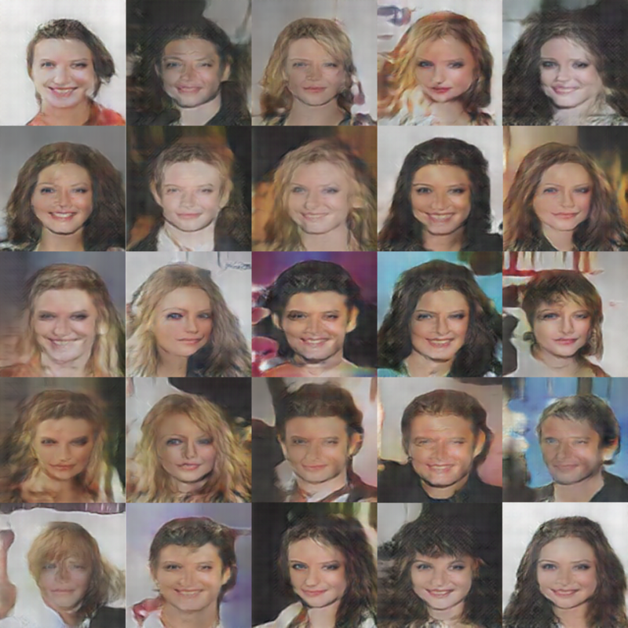
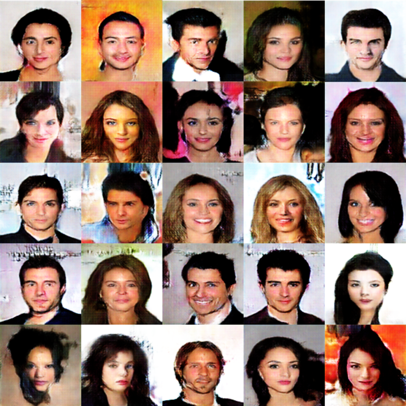

# Pytorch-GAN-implementation
GAN implementations based on PyTorch.

I've tried to replicate the original paper as closely as possible. 


## Table of Contents
  
  * [Overview](#overview) 
  * [Implementations](#implementations)
    + [DCGAN (2016 ICLR)](#dcgan)
    + [WGAN (2017 ICML)](#wgan)
    + [WGAN-GP (2017 NIPS)](#wgan-gp)
    + [CycleGAN (2017 ICCV)](#cyclegan)      


## Overview

Folder explanation

```
.
├── configs      # Training options for each model
├── data         # Managing dataset & dataloader 
├── datasets     # Location of datasets
├── model        # Orginizing Architectures(generator and discriminator) and training process
└── utils        # Utilizing functions

```

## Prerequisites

 * System
      + Windows / Linux
      + CPU or GPU(s)(Single/Multi)
      + Python 3
      
 * Libraries
      + Python>=3.6
      + PyTorch>=1.4 
      + torchvision>=0.5.0
      + numpy
      + yaml

## Implementations

### DCGAN

<b>Title of Paper</b> : Unsupervised Representation Learning with Deep Convolutional Generative Adversarial Networks

<b>Authors</b> : Alec Radford, Luke Metz, Soumith Chintala

[[Arxiv]](https://arxiv.org/abs/1511.06434) (2016 ICLR)

#### Train
To train from the scratch, check the configs/dcgan.yaml file for confirming the location of Path.

After checking, type the below command.

```
$ python3 train.py --opt configs/dcgan.yaml
```

#### Test

To test the code with the pretrained models, 

1) Check the configs/dcgan.yaml file for confirming the location of pretrained model pt/pth file. 

2) Place the pth/pt file in pretrain_model_dir path of configs/dcgan.yaml file. 

3) Type the below command.

```
$ python3 test.py --opt configs/dcgan.yaml
```

#### Results

|DCGAN (Epoch 17)|
|:---:|
||

### WGAN 

<b>Title of Paper</b> : Wasserstein GAN

<b>Authors</b> : Martin Arjovsky, Soumith Chintala, Léon Bottou

[[Offical Paper]](http://proceedings.mlr.press/v70/arjovsky17a/arjovsky17a.pdf) [[Arxiv]](https://arxiv.org/abs/1701.07875) (2017 ICML)

#### Train

```
$ python3 train.py --opt configs/wgan.yaml
```

#### Test

```
$ python3 test.py --opt configs/wgan.yaml
```

#### Results

### WGAN-GP 

<b>Title of Paper</b> : Improved Training of Wasserstein GANs

<b>Authors</b> : Ishaan Gulrajani, Faruk Ahmed, Martin Arjovsky, Vincent Dumoulin, Aaron Courville

[[Offical Paper]](https://papers.nips.cc/paper/2017/hash/892c3b1c6dccd52936e27cbd0ff683d6-Abstract.html) [[Arxiv]](https://arxiv.org/abs/1704.00028) (2017 NIPS)

[[Official Pytorch Code]-Tensorflow](https://github.com/igul222/improved_wgan_training)

#### Train

```
$ python3 train.py --opt configs/wgan_gp.yaml
```

#### Test

```
$ python3 test.py --opt configs/wgan_gp.yaml
```

#### Results

|WGAN-GP (Epoch 17)|
|:---:|
||


### CycleGAN 

<b>Title of Paper</b> : Unpaired Image-to-Image Translation using Cycle-Consistent Adversarial Networks

<b>Authors</b> : Jun-Yan Zhu(first author), Taesung Park(first author), Phillip Isola, Alexei A. Efros

[[Offical Paper]](https://openaccess.thecvf.com/content_ICCV_2017/papers/Zhu_Unpaired_Image-To-Image_Translation_ICCV_2017_paper.pdf) [[Arxiv]](https://arxiv.org/abs/1703.10593) (2017 ICCV)

[[Official Pytorch Code]- Pytorch](https://github.com/junyanz/pytorch-CycleGAN-and-pix2pix) 

#### Datasets

```
.
├── datasets                   
|   ├── <dataset_name>         # i.e. horse2zebra
|   |   ├── train              # Training
|   |   |   ├── A              # Contains domain A images (i.e. horse)
|   |   |   └── B              # Contains domain B images (i.e. zebra)
|   |   └── test               # Testing
|   |   |   ├── A              # Contains domain A images (i.e. horse)
|   |   |   └── B              # Contains domain B images (i.e. zebra)
```

<b>Download methods</b>

(1) Download from [UC Berkeley's repository](http://efrosgans.eecs.berkeley.edu/cyclegan/datasets)

(2) Run below code file which is the same bash code of the [Official CycleGAN Pytorch Code](https://github.com/junyanz/pytorch-CycleGAN-and-pix2pix/blob/master/datasets/download_cyclegan_dataset.sh). (e.g. horse2zebra)

```
bash ./dataset/download_cyclegan_dataset.sh horse2zebra
```

1. download and setup a dataset.

Dataset should be placed in datasets folder

2. checking whether the dataset directory path is different in configs/cyclegan.yaml. 
 
If there is a change, then type the path not only training but also testing.

#### Train

To train from the scratch, check the configs/cyclegan.yaml file for confirming the location of Path.

After checking, type the below command.

```
$ python3 train.py --opt configs/cyclegan.yaml
```

#### Test

To test the code with the pretrained models, 

1) Check the configs/cyclegan.yaml file for confirming the location of two test datasets and 2 pretrained model pt/pth files. 

(In CycleGAN, there are two datasets.)

2) Place the pth/pt file in pretrain_model_dir path of configs/cyclegan.yaml file. 


(Downloading the pretrained files are in below session.)

3) Type the below command.

```
$ python3 test.py --opt configs/cyclegan.yaml
```

#### Pretrained model

[[CycleGAN Pretrained pth]](https://drive.google.com/file/d/1FC0BeDzc8plkkvB69hcY5N28U1mDPssr/view?usp=sharing)

pth zip file include "160_net_G_AtoB.pth" and "160_net_G_BtoA.pth"

#### Results

The model was trained on A:Horse <-> B:Zebra dataset.

1st/2nd/3rd column is represented Original Image/Generated Image/Reconstructed Image.

|Origin: Horse / Gen: Zebra / Rec: Horse|
|:---:|
||
|Epoch 160|

|Origin: Zebra / Gen: Horse / Rec: Zebra|
|:---:|
||
|Epoch 160|

In my experience, 4GB per one batch size.

In the paper, there are 200 epochs.

With a NVIDIA RTX 2060, consume approximately 12 minutes per one epoch. (40 hours for 200 epochs)

#### Acknowledge

Code is implemented based on the paper and Official Pytorch Code version of CycleGAN. 

All credits goes to the authos of CycleGAN.

## License

This project is licensed under the GPL v3 License. 


